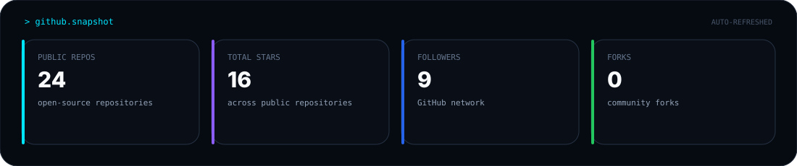
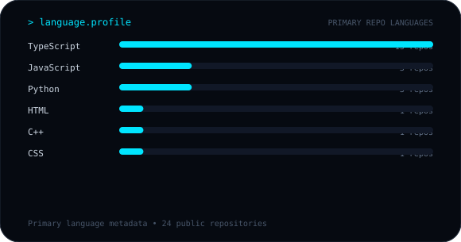
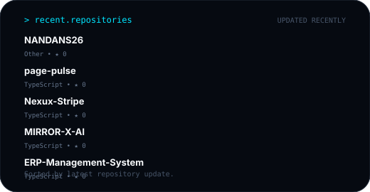

<div align="center">
  
</div>

<p align="center">
  <a href="https://github.com/NANDANS26"></a>
  <a href="https://www.linkedin.com/in/nandan-s-9279952a1/"></a>
  <a href="mailto:nandansdev26@gmail.com"></a>
</p>


## `> whoami`

Software engineer focused on backend systems, intelligent services, and automation. I build APIs, event-driven workflows, and AI-powered systems with an emphasis on reliability, maintainability, and practical engineering.

```bash
$ cat .profile

ROLE     = Software Engineer
FOCUS    = Backend Systems | AI | Automation
DOMAIN   = Backend | AI/ML | Payments | Systems Modeling
STACK    = Python | TypeScript | Node.js | FastAPI
OPEN_TO  = Backend | SDE | AI Engineering Internships + New-Grad Roles
```


## `$ ls /tech-stack`

<div align="center">

| <span style="color:#00D9FF">DOMAIN</span> | <span style="color:#00D9FF">STACK</span> |
|:---|:---|
| **Languages** |      |
| **Backend** |    · REST APIs · Authentication · Authorization · Webhooks |
| **Frontend** |  · TypeScript · Tailwind CSS |
| **AI / ML** |  · scikit-learn · LightGBM · FAISS · SentenceTransformers |
| **Databases** |    |
| **Cloud / Infra** |      |
| **Engineering** |    · Swagger / OpenAPI · CI/CD |

</div>

<details>
<summary><b>▸ Engineering capabilities</b></summary>

`API Design` · `Auth & RBAC` · `Webhooks` · `Event-driven workflows` · `Vector Search` · `ML Ranking` · `Database Design` · `Dockerized Services` · `Cloud Deployment` · `System Modeling`

</details>

## `> specialization`


### `> cat expertise.md`

| Domain | Proficiency | Details |
| :-- | :-- | :-- |
| Backend API Engineering | Strong | REST API design, authentication/authorization, structured error handling, webhooks |
| AI/ML Integration | Strong | FAISS vector search, SentenceTransformers, LightGBM ranking, explainable scoring |
| Payments & SaaS Infrastructure | Strong | Stripe Checkout/Webhooks, signature verification, RBAC, subscription lifecycle automation |
| Systems Modeling / RL | Intermediate–Strong | Reinforcement learning environments, reward design, state-transition simulation |
| Frontend | Intermediate | React component architecture, API integration |
| Cloud / DevOps | Intermediate | Google Cloud Platform, Firebase, Docker, Git-based workflows |


## `$ ls /projects --featured`

<details open>
<summary><b>&#9654; Nexus SaaS — Payment & Subscription Platform</b></summary>

A backend SaaS platform handling subscription pricing, Stripe payment processing, and lifecycle automation.

| | |
| :-- | :-- |
| **Stack** | Node.js · TypeScript · MongoDB · Stripe API · Webhooks |
| **Architecture** | Event-driven backend with signature-verified, idempotent Stripe webhook handling and RBAC-gated access |
| **Engineering contribution** | Designed subscription lifecycle logic (upgrade / renewal / cancellation) and usage-based feature enforcement tied to plan tier |
| **Key technical implementation** | Stripe Checkout integration, webhook signature verification, RBAC-based authorization |
| **Repository** | [github.com/NANDANS26/Nexux-Stripe](https://github.com/NANDANS26/Nexux-Stripe) *(closest matching public repo — flagged for your confirmation, see note below)* |

</details>

<details>
<summary><b>&#9654; SIREN — Reinforcement Learning Environment for Cyber Incident Response</b></summary>

A Python simulation environment modeling cyber incident response as a reinforcement learning problem.

| | |
| :-- | :-- |
| **Stack** | Python · FastAPI · Reinforcement Learning · System Modeling |
| **Architecture** | Interconnected services with system-level state transitions and anomaly propagation across dependent components |
| **Engineering contribution** | Designed isolation logic and deployment/recovery/validation action scenarios; built an automated evaluation pipeline |
| **Key technical implementation** | Outcome scoring combined with sequence-based analysis for agent performance validation |
| **Repository** | Private / Not publicly available |

</details>

<details>
<summary><b>&#9654; SkillVerse — AI-Based Candidate Matching System</b></summary>

A semantic candidate-matching engine that ranks candidates against job descriptions.

| | |
| :-- | :-- |
| **Stack** | React · Node.js · FastAPI · MySQL · FAISS · SentenceTransformers · LightGBM |
| **Architecture** | Python FastAPI ML service cross-communicating with a Node.js backend in real time |
| **Engineering contribution** | Built the semantic matching pipeline (embeddings + vector search) and the LightGBM ranking layer |
| **Key technical implementation** | SentenceTransformer embeddings, FAISS vector search, explainable candidate scoring |
| **Repository** | Private / Not publicly available |

</details>


## `> cat experience.log`

**Software Engineer** — Project-Based / Freelance / Startup Projects
`2024 – Present`

- Designed and built backend systems and Python applications with focus on reliability and maintainability
- Developed REST APIs with authentication, validation, logging, and structured error handling
- Integrated external APIs and automated backend workflows
- Worked in Linux-based development environments using Git and collaborative version-control workflows
- Collaborated in small teams with version control and iterative development practices
- Incorporated feedback during iterative development where applicable


## `> cat achievements.md`

<div align="center">

| Result | Event | Level |
| :--: | :-- | :--: |
| 🏆 Winner | TITAN Impact Challenge | National |
| 🥈 Runner-up | Hack Kshetra 2024 | National |
| 🏆 Winner | GDG Impact Challenge | — |
| Participant | Google Solution Challenge | — |

</div>

### `> cat certifications.yaml`

```yaml
learning_credentials:
  - title: Google Cloud Generative AI Study Jam Achiever
    year: 2024
    detail: 15 skill badges · 60+ hands-on labs
```


<div align="center">

-0B0D0F?style=for-the-badge&labelColor=0B0D0F&color=00D9FF)

</div>

## `$ ls /coding-profiles`

[](https://leetcode.com/u/nandansdev/)
[](https://www.geeksforgeeks.org/profile/4ps23cs103)
[](https://www.codechef.com/users/noble_boar_06)


## `> github-analytics`

<div align="center">

</div>

<div align="center">


</div>

<div align="center">

</div>

<p align="center"><sub>Repository metrics are generated from GitHub's API and refreshed automatically. Contribution activity is shown separately.</sub></p>


## `> cat engineering-principles.txt`

```
01  Understand the system before changing it.
02  Prefer simple interfaces over unnecessary complexity.
03  Validate failure paths, not only happy paths.
04  Build for maintainability and observability.
05  Learn unfamiliar systems through reading, testing and iteration.
```


## `> cat current-focus.yaml`

```yaml
learning:
  - Advanced Data Structures & Algorithms
  - System Design
  - Distributed Systems
  - Backend Architecture
  - Cloud Engineering

exploring:
  - Reliable API design
  - AI/ML system integration
  - Software testing and reliability
  - Automation

open_to:
  - Backend Engineering Internships
  - Software Engineering Internships
  - AI/ML Engineering Internships
  - Backend / SDE New-Grad Roles
```


## `> connect --with-me`

<div align="center">

[](https://www.linkedin.com/in/nandan-s-9279952a1/)
[](https://github.com/NANDANS26)
[](mailto:nandansdev26@gmail.com)
[](https://www.instagram.com/itz_nandan_s)

</div>

<div align="center">
<i>"Build systems that remain understandable when they become complicated."</i>
</div>


